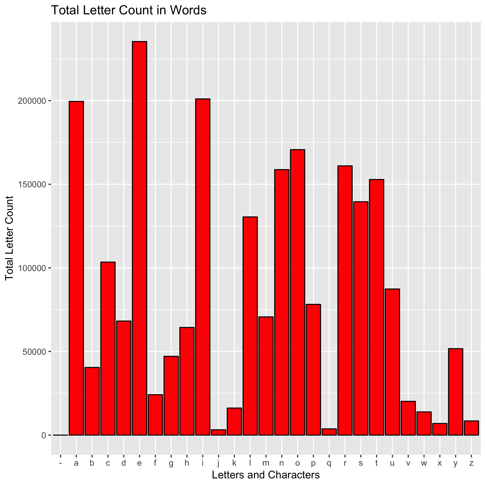

This file can be created by make all or by running make letter_analysis

To generate this graph, I computed the total frequency of each letter in the file 'words'.

Below is a bar chart showing letter frequency totals in all words in the file 'words'.

